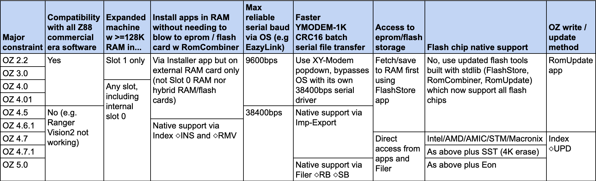

# The Cambridge Z88 Computer - An Overview

So you're interested in the Z88. You're probably technically minded. However, it's quite a difficult machine to explore for a few reasons:
- Transferring software onto the machine is complicated and slow
- Significant developments have been made to the OS incrementally since 1987, up to the present day
- Awareness of this chronology is key
- Though much of this information can be found in the Wiki, it requires a lot of reading

I aim to present here a short primer, to cover the most of the quirks of the machine that were far from obvious to a new user.


## Z88 Hardware
The Z88 uses a low power CMOS version of the Z80 processor. The base configuration has only 32KB of RAM and a 128KB ROM. Three card slots allow for the RAM to be expanded, for applications to be executed from ROM cards, and for writable EPROM storage. The Z88 was fully solid state. Consequently the Z88 has a relatively large 4MB maximum address space, 1MB per slot (the motherboard is slot 0). Remember that a Z80 CPU can only address 64KB though. The Z80 pages this 4MB address space in 16KB banks - this will be important.

The Operating System 'OZ' is stored in ROM, together with the bundled applications - chief among them PipeDream. OZ is hand written in assembly language, so it performs optimally. It supports multitasking, and the whole system is very power efficient. Once loaded with batteries the machine is never really off, it enters a sleep state when idle. Pressing both Shift keys simultaneously will sleep and wake. The RAM remains powered while asleep. Battery life is significantly extended by replacing the internal 32KB of pseudo-SRAM with a more power efficient 512KB true SRAM chip. A Z88 user could save their work documents in the RAM filesystem, but if the machine crashed this would be lost. EPROM cards offered a non-volatile solution, though they needed erasing with UV light. Later, flash memory cards were made to better fit this requirement.

You will encounter mentions of an "Expanded" Z88 configuration, which is a machine which has 128KB or more of additional RAM in card slot 1 (or in any slot after OZ 4.0). This enlarges the PipeDream document map view and, crucially, it expands the BBC BASIC workspace from 8KB to 40KB.


## Applications, and Storage

### First there were ROM apps...

Z88 applications were originally distributed on Eprom cards, to be inserted into the machine's three available slots. Application cards can be inserted and ejected safely while the computer is on, provided that the app is not running. Combining multiple apps onto a single card is clearly desirable. These ROMs can be dumped out into their constituent 16KB bank files. There are a maximum of 64 x 16KB banks in a card slot's 1MB address space. These are numbered in reverse order from 63 to 0. When you see files with these numbered file extensions starting at .63 you are looking at a Z88 ROM image.

The first utility that allowed users to write their own compilations of applications was RomCombiner. It's very flexible, but somewhat tricky for a new Z88 user to understand. It also needs an expanded Z88 configuration, or else you will encounter a "Bad Program" error. RomUpdate is a newer but more straightforward tool to write applications or OZ versions to flash.

There is another consideration - flash storage can only be erased in 64KB sectors (though exceptionally, SST flash memory uses 4KB sectors). Romcombiner has now been updated to allow individual 16KB banks to be erased on SST devices.

### Then came RAM apps...

In around 2000, a separate Installer application was developed by Garry Lancaster which allowed ROM dumps to be loaded into RAM and executed from there, avoiding the complexity of combining and blowing the ROM images to EPROM or flash storage. This RAM app support was integrated into OZ 4.6 onwards. A RAM app consists of a .app header, and the same 16KB banks as the ROM app, with .63 bank becoming .ap0, .62 becoming .ap1, and so on.
The OZ 5.0 RAM app specification added lz49 compression and allows an app to be concatenated into a single file for simplicity. Serial transfers become less cumbersome, and you can then fit more apps on your flash card.

### Should I use ROM apps or RAM apps?
- For tinkering with a real Z88 to explore its software - RAM apps would be the easiest way, provided you have plenty of RAM.
- If you are mainly using OZvm emulator, then ROM apps are easier (click on a slot for a new flash card, then 'load images' and select multiple numbered bank files, or a single .epr file)


## OZ version selection
### Features and constraints


### Suggestions
- For compatibility with all Z88 software and significant quality-of-life additions built-in (FlashStore, RomCombiner, RomUpdate, XY-Modem, EazyLink2, Installer) plus some bundled application software (SpellMaster, Vision2) - use my custom [OZ 4.0 Downgrade ROM](https://cambridgez88.jira.com/wiki/spaces/ZP/pages/2680160375/Slot+0+Flash+Downgrade)
- Else use [OZ 4.7.1](https://sourceforge.net/projects/z88/files/Z88%20ROM/) which is the recommended modern stable build (2016)
- However if you want more features (a command shell, ANSI terminal, ISO Latin-9 support, device password, compressed RAM apps, flash memory deleted space reclamation, PCL5 printing) and faster performance, but at beta level readiness - then try [OZ 5.0](https://sourceforge.net/projects/z88/files/Z88%20ROM/)

## Non-obvious tips
- To see running OZ version details: `INDEX` `HELP` `←`
- To boot a custom ROM file in OZvm click on the left box in Slot 0 below the keyboard
- Newer OZ versions allow you to hold `ESC` on boot to skip Slot 1 ROM boot
- Use YMODEM for fastest serial file transfer - guide [here](https://cambridgez88.jira.com/wiki/spaces/ZP/pages/2676457477/YMODEM+fastest).
- The device names take the form `:type.slot` (e.g. `:RAM.0` `:RAM.1` `:EPR.1`) so a full file path would take the form `:RAM.0/work/mydoc.txt`
- Flash memory is addressed as if it is EPROM, hence `:EPR.x`
- In Filer `TAB` can mark multiple selections, `SHIFT` `↓` navigates into a directory, and `SHIFT` `↑` exits back up a level

### How to convert a .BAS file back to text
This information is from the section "Editing BASIC programs using PipeDream" in the [Filer reference](https://cambridgez88.jira.com/wiki/spaces/UG/pages/35913796/Section+Seven+-+Filer+reference) (a very useful page)
- You can tee screen output to the special file `:RAM.-/S.sgn`
- In BASIC you can type `LIST □+S` to dump a program listing out to this text file
- Then type `□-S` (typed in full with the minus, followed by `ENTER`) to stop the tee
- Then use PipeDream to load (`◇` `F` `L`) the file `:RAM.-/S.sgn`
- Add:
  ```
  #B
  .J
  NEW
  ```
  to the top, and add `SA."MyProgName.bas"` to the end of the file, and save the PipeDream file with a CLI extension. When this file is executed from Filer it will type the entire listing into the BASIC interpreter and save it too.

### Transferring CLI files to OZvm
If you are using the OZvm emulator you will need to use PipeDream to open each file as plain text, then save it once more as plain text to fix the line endings (which are fixed automatically by EazyLink during a serial file transfer to a real Z88).

### Bank addressing knowledge for RomCombiner
- 1MB flash card:
  ```
  Flash $00 to $3F ( 0 to 63)
  ```

- Hybrid cards (512KB RAM/512KB Flash):
  ```
  RAM   $00 to $1F ( 0 to 31)
  Flash $20 to $3F (32 to 63)
  ```

- Slot 0 (motherboard):
  ```
  Flash $00 to $1F ( 0 to 31)
  RAM   $20 to $3F (32 to 63)
  ```

It's trivial to combine single bank applications onto a single card. However, apps which occupy multiple banks will contain their own bank switching code which often makes assumptions about which banks it will occupy and which physical slots it may reside in, which can prevent such apps from working in compilations. They can be fixed though with some patience and the disassembler [dzasm](https://gitlab.com/b4works/dzasm/-/tree/master). See my own binary hacks below.

## My contributions to the Z88
- [Internal 512KB SRAM upgrade guide](https://sinclairzxworld.com/viewtopic.php?p=43036).
- [No traces cut ROM to 512KB flash upgrade guide](https://sinclairzxworld.com/viewtopic.php?p=43320).
- [Ported additional flash memory compatibility](https://bitbucket.org/cambridge/z88/pull-requests/1) from OZ 4.7.1 and 5.0 back to the Z88 standard library.
- [Recompiled existing standalone apps with the above support](https://www.sinclairzxworld.com/viewtopic.php?f=24&t=4783) (FlashStore, RomCombiner, RomUpdate, EazyLink2, FlashTest). Crucially, this allows a stock Z88 to write to all flash cards. Newer flash chip choices following the obsolesence of the Intel and AMD flash chips had prevented this, making an unmodified Z88 unable to bootstrap itself to a newer version of OZ.
- [Improved FlashStore](https://bitbucket.org/cambridge/z88/pull-requests/2) to graphically indicate SST flash cards.
- [Improved RomCombiner](https://bitbucket.org/cambridge/z88/pull-requests/3) to distinguish between 64KB sector erasing (four 16KB banks) or 4 x 4KB sector erasing where supported (individual 16KB bank), and to display valid ranges for selection [even for the inverted slot 0](https://bitbucket.org/cambridge/z88/pull-requests/6).
- [Improved FlashTest](https://bitbucket.org/cambridge/z88/pull-requests/1/diff#chg-z88apps/flashtest/fltest.asm) with 4KB sector support, and displaying the card type before starting the test.
- [Updated and tidied SourceForge download site](https://sourceforge.net/projects/z88/files/).
- [Updated the 4.7.1 ROM zip file](https://sourceforge.net/projects/z88/files/Z88%20ROM/V4.7.1/) to include descriptive folder names to simplify.
- [Documented faster YMODEM serial file transfers](https://cambridgez88.jira.com/wiki/spaces/ZP/pages/2676457477/YMODEM+fastest) with modern computers.
- [Manual for Z-Tape application](https://cambridgez88.jira.com/wiki/spaces/ZP/pages/2676293651/Z-Tape) on the Z88 Wiki (OCRed from the included photocopies using Preview on macOS, and cleaned up). Devised styles to add content using the new Confluence editor, in particular a usable replacement for inline images for Z88 keys in the form of unicode characters in code blocks (e.g. `HELP` `INDEX` `ESC` `◇` `□` `↑` `↓` `←` `→`).
- [Manual for Ranger Vision2 application](https://cambridgez88.jira.com/wiki/spaces/ZP/pages/2679144450/Vision) captured from [Rakewell.com page](http://www.rakewell.com/z88/z88comlinks_n.shtml#vision) and tidied to new style as per above.
- [Binary hacked Ranger Vision2 terminal](https://cambridgez88.jira.com/wiki/spaces/ZP/pages/2702114818/Vision2+Fix+Patch) for relative bank addressing, and to exit to prevent crashing newer OZ.
- [Binary hacked SpellMaster](https://cambridgez88.jira.com/wiki/spaces/ZP/pages/2735439875/Spell-Master+Fix+Patches) for relative bank addressing.
- [Built and documented an OZ Downgrade ROM and process](https://cambridgez88.jira.com/wiki/spaces/ZP/pages/2680160375/Slot+0+Flash+Downgrade) to allow an upgraded Z88 to return to full compatibility with old world software.

## To do:
- Describe the files in an OZ ROM bundle (see readme from OZ 4.5)
